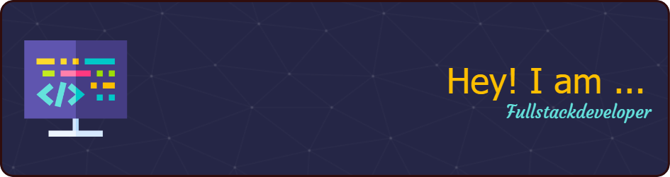

<h1 align="center">Hi 👋, I'm Yash Dhakate</h1>
<h3 align="center">A passionate frontend developer from India.</h3>

- 🔭 I’m currently working on **Multi-Person CodeEditor**

- 🌱 I’m currently learning **PHP**

- 💬 Ask me about **React Vue GSAP Express MongoDB**

- 📫 How to reach me **yashmdhakate@gmail.com**

- ⚡ Fun fact **You don't need to buy me a Coffee...**
 

<h3 align="left" style="display:flex; gap:4;">Languages and Tools:</h3>

                  

